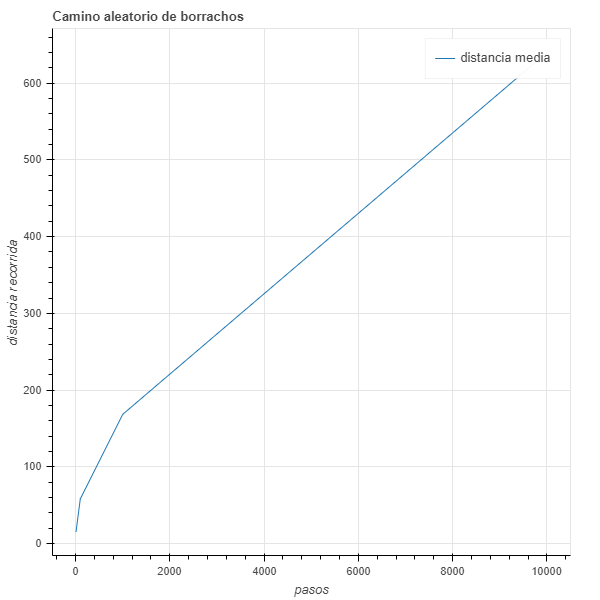
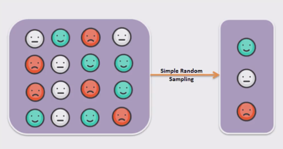
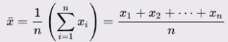
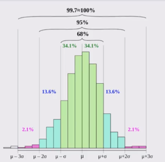
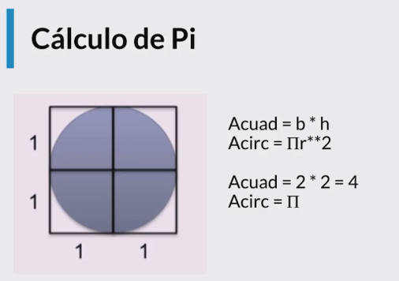

# Curso de Programación Dinámica y Estocástica con Python

## Indice

- [Curso de Programación Dinámica y Estocástica con Python](#curso-de-programación-dinámica-y-estocástica-con-python)
  - [Indice](#indice)
  - [Modulo 1. Introducción](#modulo-1-introducción)
    - [Clase 1 Objetivo del Curso](#clase-1-objetivo-del-curso)
  - [Modulo 2. Programación Dinámica](#modulo-2-programación-dinámica)
    - [clase 2 Introducción a la Programación Dinámica](#clase-2-introducción-a-la-programación-dinámica)
      - [Memoization](#memoization)
    - [Clase 3 Optimización de Fibonacci](#clase-3-optimización-de-fibonacci)
  - [Modulo 3 Caminos Aleatorios](#modulo-3-caminos-aleatorios)
    - [clase 4 Que son los caminos aleatorios](#clase-4-que-son-los-caminos-aleatorios)
    - [Clase 5 Camino de Borrachos](#clase-5-camino-de-borrachos)
    - [Clase 6 Desarrollando la simulación](#clase-6-desarrollando-la-simulación)
    - [Clase 7 Visualización de Caminos Aleatorios](#clase-7-visualización-de-caminos-aleatorios)
  - [Modulo 4. Programas Estocásticos](#modulo-4-programas-estocásticos)
    - [clase 8 Introducción a la Programación Estocástica](#clase-8-introducción-a-la-programación-estocástica)
    - [Clase 9 Cálculo de Probabilidades](#clase-9-cálculo-de-probabilidades)
    - [Clase 10 Simulacion de probabilidades](#clase-10-simulacion-de-probabilidades)
    - [Clase 11 Inferencia estadistica](#clase-11-inferencia-estadistica)
      - [Ley de los grandes números](#ley-de-los-grandes-números)
      - [Falacia del apostador](#falacia-del-apostador)
    - [Clase 12 Media](#clase-12-media)
    - [Clase 13 Varianza y Desviacion Estandar](#clase-13-varianza-y-desviacion-estandar)
      - [Varianza](#varianza)
      - [Desviación estándar](#desviación-estándar)
    - [Clase 14 Distribucion Normal](#clase-14-distribucion-normal)
      - [Regla empírica](#regla-empírica)
  - [Modulo 5. Simulaciones de Montecarlo](#modulo-5-simulaciones-de-montecarlo)
    - [Clase 15 Que son las Simulaciones de Montecarlo](#clase-15-que-son-las-simulaciones-de-montecarlo)
    - [Clase 17 Calculo de PI](#clase-17-calculo-de-pi)
    - [Clase 18 Implementacion delCalculo de PI](#clase-18-implementacion-delcalculo-de-pi)
  - [6. Muestreo e Intervalos de Confianza](#6-muestreo-e-intervalos-de-confianza)
    - [Clase 19 Muestreo](#clase-19-muestreo)
    - [Clase 20 Teorema del Limite Central](#clase-20-teorema-del-limite-central)
  - [Modulo 7 Datos Experimentales](#modulo-7-datos-experimentales)
    - [Clase 21 Como trabajar con datos experimentales](#clase-21-como-trabajar-con-datos-experimentales)
    - [Clase 22 Regresion Lineal](#clase-22-regresion-lineal)

## Modulo 1. Introducción

### Clase 1 Objetivo del Curso

Debes contar con conocimientos de complejidad algoritmica, por lo que es necesario repasar esos conocimientos. Veremos las diferencias entre  la programacion estocastica(cuando no tenemos certeza acerca de los datos con que vamos a trabajar) y la programacion deterministica (con la que siempre he trabajado).

## Modulo 2. Programación Dinámica

### clase 2 Introducción a la Programación Dinámica

En la década de los 50s Richard Bellman necesitaba financiamiento del gobierno para poder continuar con sus investigaciones, por lo que necesitaba un nombre rimbombante para que no fueran capaz de rechazar su solicitud, por lo que eligió programación dinámica. Las propias palabras de Bellman fueron:

“[El nombre] Programación Dinámica se escogió para esconder a patrocinadores gubernamentales el hecho que en realidad estaba haciendo Matemáticas. La frase Programación Dinámica es algo que ningún congresista puede oponerse.” - Richard Bellman.

Ya sabiendo que Programación Dinámica no esta relacionado con su nombre, lo cierto es que si **es una de las técnicas mas poderosas para poder optimizar cierto tipos de problemas**.

Los problemas que puede optimizar son aquellos que tienen una **subestructura óptima**, esto significa que una solución óptima global se puede encontrar al combinar soluciones óptimas de subproblemas locales (_divide y venceras_).

También nos podemos encontrar con los **problemas empalmados**, los cuales implican resolver el mismo problema en varias ocasiones para dar con una solución óptima (recursividad).

#### Memoization

- Una técnica para obtener una alta velocidad en nuestro programa es la Memorización, el cual consiste en guardar cómputos previos y evitar realizarlos nuevamente.
- Normalmente se utiliza un diccionario, donde las consultas se pueden hacer en O(1)no importando que tan grande sea el diccionario.
- Intercambiamos tiempo de computo por espacio espacio en memoria.

### Clase 3 Optimización de Fibonacci

La serie de Fibonacci se representa como Fn = Fn-1 + Fn-2 (numero de  fibonnacci menos 1, mas el numero de fibonnaci menos 2)y es muy simple implementarla de forma recursiva en código. Sin embargo es muy ineficiente hacerlo simplemente recursivo, ya que repetimos varias veces el mismo computo.


Si te fijas en la imagen te darás cuenta de que repetimos varias veces el calculo para `f(4), f(3), f(2), f(1) y f(0)`, esto significa que nuestro algoritmo crece de forma exponencial `O(2**n)`.

Para optimizar nuestro algoritmo implementaremos en primer lugar la función recursiva para luego dar paso a la memorización, con esto las mejoras serán realmente sorprendentes.

```py
import time
import sys
def fibonnaci_recursivo(n):
    if n == 0 or n == 1:
        return 1

    return fibonnaci_recursivo(n - 1) + fibonnaci_recursivo(n - 2)

def fibonnaci_dinamico(n, memo = {}):
    if n == 0 or n == 1:
        return 1

    try:
        return memo[n]
    except KeyError as e:
        resultado = fibonnaci_dinamico(n - 1, memo) + fibonnaci_dinamico(n - 2, memo)
        memo[n] = resultado

        print(memo)
        return resultado

if __name__ == "__main__":
    sys.setrecursionlimit(1000002)
    n = int(input('Escogeun numero: '))
    comienzo = time.time()

    resultado = fibonnaci_dinamico(n)
    print(resultado)

    final = time.time()
    print(final - comienzo)
```

**Recuerda** para poder usar la programacion dinamica, debe haber problemas empalmados (_resolver el mismo problema en varias ocasiones para dar con una solución óptima (recursividad)_).

## Modulo 3 Caminos Aleatorios

### clase 4 Que son los caminos aleatorios

Los *caminos aleatorios* son un tipo de simulación que elige aleatoriamente una decisión dentro de un conjunto de decisiones válidas. Se utiliza en muchos campos del conocimiento cuando los sistemas no son deterministas e incluyen elementos de aleatoriedad.

### Clase 5 Camino de Borrachos

Este es un ejercicio toma un punto 0 como origen y aleatoriamente podemos decidir que dirección tomar, dependiendo de las c establecida, para elo haremos 3 clases distintas en tres archivos "borrachos", "coordenadas" y "campo".

Borracho

```py
# Creamos un archivo borracho.py
import random

# Creamos nuestra Clase borracho.
class Borracho:

    def __init__(self, nombre):
        self.nomber = nombre

# Creamos la clase BorrachoTradicional que extiende de Borracho.
class BorrachoTradicional(Borracho):

    def __init__(self, nombre):
        super().__init__(nombre)

    # Y tendrá un método caminar que devolverá la dirección a la que ira.
    def camina(self):
        return random.choice([(0, 1), (0, -1), (1, 0), (-1, 0)])
```

Coordenadas

```py
# La clase Coordenada guardara las coordenadas de nuestro Borracho
class Coordenada:

    def __init__(self, x, y):
        self.x = x
        self.y = y

    # cuando se mueve simplemente a las coordenadas actuales se les
    # suma las coordenadas X e Y que ingresan como parámetros.
    def mover(self, delta_x, delta_y):
        return Coordenada(self.x + delta_x, self.y + delta_y)

    # Y si queremos saber la distancia del agente con respecto a
    # unas coordenadas, simplemente lo calculamos con el
    # teorema de Pitágoras.
    def distancia(self,otra_coordenada):
        delta_x = self.x - otra_coordenada.x
        delta_y = self.y - otra_coordenada.y

        return (delta_x**2 + delta_y**2)**0.5

```

Campo

```py

class Campo:

    def __init__(self):
        self.coordenadas_de_borrachos = {}

     # Añadimos un agente a nuestro diccionario, nuestra llave sera
    # nuestro parámetro "borracho" y tendrá el valor asignado "coordenada"
    # que es una clase Coordenada creado en coordenada.py.
    def anadir_borrachos(self, borracho, coordenada):
        self.coordenadas_de_borrachos[borracho] = coordenada

    def mover_borracho(self, borracho):
        # Al mover a nuestro agente ejecutamos el método camina de
        # nuestra clase BorrachoTradicional creado en el archivo borracho.py,
        # devolviendo la dirección hacia donde se movió.
        delta_x, delta_y = borracho.camina()

        # Obtenemos el objeto de Coordenada.
        coordenada_actual = self.coordenadas_de_borrachos[borracho]

        # Del objeto Coordenada ejecutamos el método mover con los parámetros
        # que el objeto borracho genero. El resultado lo guardamos en
        # nueva_coordenada.
        nueva_coordenada = coordenada_actual.mover(delta_x, delta_y)

        # El objeto guardado en nueva_coordenada ahora estará asociado
        # a la llave de borracho.
        self.coordenadas_de_borrachos[borracho] = nueva_coordenada

    def obtener_coordenada(self, borracho):
        return self.coordenadas_de_borrachos[borracho]
```

### Clase 6 Desarrollando la simulación

Creamos  camino_aleatorio.py

```py
from borracho import BorrachoTradicional
from campo import Campo
from coordenada import Coordenada

def caminata(campo, borracho, pasos):
    # De la instancia Campo obtenemos las coordenadas actuales de la llave "borracho".
    inicio = campo.obtener_coordenada(borracho)

    # Repetiremos la misma cantidad de pasos definidos.
    for _ in range(pasos):

        # De la instancia campo ejecutaremos mover_borracho.
        campo.mover_borracho(borracho)

     # Y devolveremos la distancia entre las coordenadas de la instancia
    # inicio y campo.
    return inicio.distancia(campo.obtener_coordenada(borracho))


def simular_caminata(pasos, numero_de_intentos, tipo_de_borracho):

    # Definimos los parámetros para crear una instancia de Campo.
    borracho = tipo_de_borracho(nombre='David')
    origen = Coordenada(0,0)

    # Creamos una lista que guardara las distancias en cada simulación.
    distancias = []

    # Por cada numero de intento.
    for _ in range(numero_de_intentos):
        # Creamos una instancia de Campo.
        campo = Campo()

         # A nuestra instancia de Campo le damos la llave borracho y sus coordenadas de origen.
        campo.anadir_borrachos(borracho, origen)

        # Obtenemos la distancia final de la simulación.
        simulacion_caminata = caminata(campo, borracho,pasos)

        # El resultado lo guardamos en la lista de distancias.
        distancias.append(round(simulacion_caminata, 1))

    # Retornamos la lista de distancias.
    return distancias

def main(distancias_de_caminata, numero_de_intentos, tipo_de_borracho):

    for pasos in distancias_de_caminata:
        distancias = simular_caminata(pasos, numero_de_intentos, tipo_de_borracho)
        distancia_media = round(sum(distancias) / len(distancias),4)
        distancia_maxima = max(distancias)
        distancia_minima = min(distancias)
        print(f'{tipo_de_borracho.__name__} caminata aleatoria de {pasos} pasos')
        print(f'Media = {distancia_media}')
        print(f'Max = {distancia_maxima}')
        print(f'Min = {distancia_minima}')

```

### Clase 7 Visualización de Caminos Aleatorios

Ejecutamos caminos aleatorios..

```py
from borracho import BorrachoTradicional
from campo import Campo
from coordenada import Coordenada

from bokeh.plotting import figure, show


def caminata(campo, borracho, pasos):
    # De la instancia Campo obtenemos las coordenadas actuales de la llave "borracho".
    inicio = campo.obtener_coordenada(borracho)

    # Repetiremos la misma cantidad de pasos definidos.
    for _ in range(pasos):

        # De la instancia campo ejecutaremos mover_borracho.
        campo.mover_borracho(borracho)

     # Y devolveremos la distancia entre las coordenadas de la instancia
    # inicio y campo.
    return inicio.distancia(campo.obtener_coordenada(borracho))


def simular_caminata(pasos, numero_de_intentos, tipo_de_borracho):

    # Definimos los parámetros para crear una instancia de Campo.
    borracho = tipo_de_borracho(nombre='David')
    origen = Coordenada(0, 0)

    # Creamos una lista que guardara las distancias en cada simulación.
    distancias = []

    # Por cada numero de intento.
    for _ in range(numero_de_intentos):
        # Creamos una instancia de Campo.
        campo = Campo()

        # A nuestra instancia de Campo le damos la llave borracho y sus coordenadas de origen.
        campo.anadir_borrachos(borracho, origen)

        # Obtenemos la distancia final de la simulación.
        simulacion_caminata = caminata(campo, borracho, pasos)

        # El resultado lo guardamos en la lista de distancias.
        distancias.append(round(simulacion_caminata, 1))

    # Retornamos la lista de distancias.
    return distancias


def graficar(x, y):
    grafica = figure(title='Camino aleatorio de borrachos',
                     x_axis_label='pasos', 
                     y_axis_label='distancia recorrida')
    grafica.line(x,y, legend='distancia media')
    
    show(grafica)


def main(distancias_de_caminata, numero_de_intentos, tipo_de_borracho):
    distancias_media_por_caminata = []
    for pasos in distancias_de_caminata:
        distancias = simular_caminata(
            pasos, numero_de_intentos, tipo_de_borracho)
        distancia_media = round(sum(distancias) / len(distancias), 4)
        distancias_media_por_caminata.append(distancia_media)
        distancia_maxima = max(distancias)
        distancia_minima = min(distancias)
        print(f'{tipo_de_borracho.__name__} caminata aleatoria de {pasos} pasos')
        print(f'Media = {distancia_media}')
        print(f'Max = {distancia_maxima}')
        print(f'Min = {distancia_minima}')

    graficar(distancias_de_caminata, distancias_media_por_caminata)

if __name__ == "__main__":
    distancias_de_caminata = [10, 100, 1000, 10000]
    numero_de_intentos = 10

    main(distancias_de_caminata, numero_de_intentos, BorrachoTradicional)
```

Dentro el pensamiento estocástico debemos realizar varias simulaciones, por ese motivo en el ejemplo anterior realizamos varios intentos. Lo importante de esta aleatoriedad es que podemos distribuirla a lo largo de varios intentos, con esto podemos obtener certeza de que el comportamiento de nuestro programa se comporte en que esperamos estadísticamente.


Grafica obtenida



## Modulo 4. Programas Estocásticos

### clase 8 Introducción a la Programación Estocástica

- Un programa es **determinístico** cuando se corre con un mismo input produce el mismo output.

- Los programas determinísticos son muy importantes, pero existen problemas que no pueden resolverse de esa manera.

- La programación **estocástica** permite introducir aleatoriedad a nuestros programas para crear simulaciones que permiten resolver otro tipo de problemas.

- Podemos hacer diversas simuaciones:trafico, trading, efectos de medicamentos en el cuerpo humano, desarrollode vehiculos autonomos.

- Los programas estocásticos se aprovecha de distribuciones probabilísticas de un problema se conocen o pueden ser estimadas mediante inferencia estadistica.

- Al hablar de probabilidad preguntamos qué fracción de todos los posibles eventos tiene la propiedad que buscamos.
- Por eso es importante poder calcular todas las posibilidades de un evento para entender su probabilidad.
- La probabilidad de que un evento suceda y de que no suceda es siempre 1.

Ley del complemento:

- P(A) + P(~A) = 1

> La probabilidad de A + La probabilidad de NO-A es igual a 1

Ley multiplicativa:

- P(A y B) = P(A) * P(B)

Ley aditiva:

- P(A o B) = P(A) + P(B) (Mutuamente exclusivos)
- P(A o B) = P(A) + P(B) - P(A y B) (No exclusivos)

Para ver un ejemplo práctico de las leyes anteriores vamos a realizar un ejercicio de el lanzamiento de un dado de 6 caras:

La probabilidad de que salga el número 1:

Tenemos 6 posibilidades y el número 1 es una de ellas, por lo que la probabilidad es 1/6.

La probabilidad de que nos toque el numero 1 o 2:

Tenemos 6 posibilidades y el número 1 es una de ellas y el 2 es otra. El que nos toque un número es mutuamente exclusivo, ya que no podemos obtener 2 números al mismo tiempo. Bajo esta premisa utilizaremos la ley aditiva mutuamente exclusiva.

P(1 o 2) = P(1) + P(2)

P(1 o 2) = 1/6 + 1/6

P(1 o 2) = 2/6

La probabilidad de que nos salga el número 1 al menos 1 vez en 10 lanzamientos:

Para cada lanzamiento tenemos la posibilidad de 1/6 de que nos toque 1, por lo que utilizamos la ley multiplicativa.

(1/6)^10 = 0.8333

### Clase 9 Cálculo de Probabilidades

- La **probabilidad** es una medida de la certidumbre asociada a un evento o suceso futuro y suele expresarse como un número entre 0 y 1.
- Una probabilidad de 0 significa que un suceso jamás sucederá
- Una probabilidad de 1 significa que está garantizado que sucederá.

### Clase 10 Simulacion de probabilidades
  
```py
import random


def tirar_dado(numero_de_tiros):
    secuencia_de_tiros = []

    for _ in range(numero_de_tiros):
        tiro = random.choice([1,2,3,4,5,6])
        secuencia_de_tiros.append(tiro)

    return secuencia_de_tiros


def main(numero_de_tiros, numero_de_intentos):
    tiros = []

    for _ in range(numero_de_intentos):
        secuencia_de_tiros = tirar_dado(numero_de_tiros)
        tiros.append(secuencia_de_tiros)

    tiros_con_1 = 0
    for tiro in tiros:
        if 1 in tiro:
        # if 1 not in tiro:
            tiros_con_1 += 1

    probabilidad_tiros_con_1 = tiros_con_1 / numero_de_intentos
    print(f'Probabilidad de obtener por lo menos un 1 en {numero_de_tiros} en tiros = {probabilidad_tiros_con_1}')
    # print(f'Probabilidad de no obtener por lo menos un 1 en {numero_de_tiros} en tiros = {probabilidad_tiros_con_1}')

if __name__ == "__main__":
    numero_de_tiros = int(input('Cuantos tiros del dado: '))
    numero_de_intentos = int(input('Cuantas veces correra la simulacion: '))

    main(numero_de_tiros, numero_de_intentos)
```

Reto hacer lo mismopara dos datos

### Clase 11 Inferencia estadistica

- Con las simulaciones podemos calcular las probabilidades de eventos complejos sabiendo las probabilidades de eventos simples.
S
- ¿Que pasa cuando no sabemos las probabilidades de los eventos simples?
- Las técnicas de la inferencia estadística nos permiten inferir/concluir las propiedades de una población a partir de una muestra aleatoria.

>"El principio guía de la inferencia estadística es que una muestra leatoria tiende a exhibir las mismas propiedades que la población de la cual fue extraída." - John Guttag

Algo importante sobre las muestras es que siempre deben ser aleatorias para evitar esten sesgadas.


En preguntas de entrevista, puedes procesar todo el dataset, o mejor aun tomar muestras aleatorias de la poblacion total.



#### Ley de los grandes números

En pruebas independientes repetidas con la misma probabilidad p de un resultado, la fracción de desviaciones de p converge a cero conforme la cantidad de pruebas se acerca al infinito.


Esto se interpreta de la siguiente manera:

La probabilidad de que la media de la poblacion (n), se acerque a la media de la  poblacion total, conforme al limite tiende al infinito es igual a 1

#### Falacia del apostador

- La falacia del apostador señala que después de un evento extremo, ocurrirán eventos menos extremos para nivelar la media.(nada mas falso, cada evento es independiente)

- La regresion a la media señala que después de un evento aleatorio extremo, el siguiente evento probablemente será menos extremo.

Ejemplo 1943 evento extremo en uno de los casinos de montecarlo, despues de 32 rojos.

### Clase 12 Media

El primer paso dentro de la inferencia estadistica es calcilar la media.

- La media es una medida de tendencia central
- comúnmente conocido como promedio.
- La media de una población se denota con el símbolo μ (miu) y la media de una muestra se define con X̄ (exbar).


Tenemos un arreglo de x que comienzan en el indice 1 terminan en en, lo  divides en n




estadisticas.py

```py
import random

def media(X):
    return sum(X) / len(X)

if __name__ == "__main__":
    X = [random.randint(1, 21) for i in range(20)]
    mu = media(X)

    print(X)
    print(mu)
```

### Clase 13 Varianza y Desviacion Estandar

Simpre que hablamos de inferencia estadistica el primer paso es calcular la media, y el segundo es calcular la varianza y la desviacion estandar.

#### Varianza

- La varianza *mide que tan propagado* se encuentra un conjunto de valores aleatorios de su media.
- Mientras que la media nos da una idea de donde se encuentran los valores, la varianza nos dice que tan dispersos se encuentran.
- La varianza siempre debe entenderse con respecto a la media


xi son los elementos del array menos la media al cuadrado entre el numero de elementos.

#### Desviación estándar

- La desviación estándar es la raíz cuadrada de la varianza.
- Nos permite entender, también, *la propagación* y se debe entender siempre relacionado con la media.
- La ventaja sobre la varianza es que la desviación estándar está en las mismas unidades que la media.


```py
import random
import math
def media(X):
    return sum(X) / len(X)

def varianza(X):
    mu = media(X)

    acumulador = 0

    for x in X:
        acumulador += (x - mu)**2

    return acumulador / len(X)

def desviacion_estandar(X):
    return math.sqrt(varianza(X))


if __name__ == "__main__":
    X = [random.randint(1, 21) for i in range(20)]
    mu = media(X)
    Var = varianza(X)
    sigma = desviacion_estandar(X)

    print(f'Arreglo X: {X}')
    print(f'Media = {mu}')
    print(f'Varianza = {Var}')
    print(f'Desviacion estandar = {sigma}')
```

```cli
Arreglo X: [20, 7, 12, 13, 12, 20, 8, 12, 7, 7, 7, 2, 4, 19, 6, 18, 2, 4, 17, 1]
Media = 9.9
Varianza = 37.59
Desviacion estandar = 6.131068422387733
```

### Clase 14 Distribucion Normal

Es una de las mas comunes dentro del mundo de la estadistica.

- La distribución normal es una de las distribuciones mas recurrentes en cualquier ámbito.
- Se define completamente por su media y su desviación estándar.
- Permite calcular intervalos de confianza con la regla empírica.
- Se puede convertir una distribucion que no es normal en normal a traves del teorema de limite central.
  


En el siguiente ejemplo vamos una unas distribuciones con desviación estándar 1 y 3. Cuando la desviación es baja significa la variabilidad de los datos es menor.


#### Regla empírica

También conocida como la regla 68-95-99.7.Es una regla muy sencilla que nos permite analizar como se distribuyen los datos dentro de una distribucion normal sabiendo cuales son los datos que podemos encontrar a  uno, dos y tres sigmas.

Permite calcular probabilidades con la densidad de la distribución normal.




## Modulo 5. Simulaciones de Montecarlo

### Clase 15 Que son las Simulaciones de Montecarlo

- Creada por Stanisław Marcin Ulam
- Permite crear simulaciones para predecir el resultado de un problema - Permite convertir problemas determinísticos en problemas estocásticos.
- Es utilizado en gran diversidad de áreas, desde la ingeniería hasta la biología y el derecho.


```py
import random
import collections

PALOS = ['espada','corazon', 'rombo', 'trebol']
VALORES = ['as', '2', '3', '4', '5', '6', '7', '8', '9', '10', 'jota', 'reina', 'rey']


def crear_baraja():
    barajas = []
    for palo in PALOS:
        for valor in VALORES:
            barajas.append((palo, valor))

    return barajas

def obtener_mano(barajas, tamano_mano):
    mano = random.sample(barajas, tamano_mano)

    return mano

def main(tamano_mano, intentos):
    barajas = crear_baraja()

    manos = []
    for _ in range(intentos):
        mano = obtener_mano(barajas, tamano_mano)
        manos.append(mano)

    pares = 0
    for mano in manos:
        valores = []
        for carta in mano:
            valores.append(carta[1])

        counter = dict(collections.Counter(valores))
        for val in counter.values():
            if val == 2:
                pares += 1
                break

    probabilidad_par = pares / intentos

    print(
        f'La probabilidad de obtener un par en mano de {tamano_mano} barajas es {probabilidad_par}')

if __name__ == "__main__":

    tamano_mano = int(input('De cuantas barajas sera la mano: '))
    intentos = int(input('Cuantos intentos para calcular a probabilidad: '))
    main(tamano_mano, intentos)
```

### Clase 17 Calculo de PI




### Clase 18 Implementacion delCalculo de PI

```py
import random
import math
from estadisticas import desviacion_estandar, media


def aventar_agujas(numero_de_agujas):
    adentro_del_circulo = 0

    for _ in range(numero_de_agujas):
        x = random.random() * random.choice([-1, 1])
        y = random.random() * random.choice([-1, 1])
        distancia_desde_el_centro = math.sqrt(x**2 + y**2)

        if distancia_desde_el_centro <= 1:
            adentro_del_circulo += 1

    return (4 * adentro_del_circulo) / numero_de_agujas


def estimacion(numero_de_agujas, numero_de_intentos):
    estimados = []
    for _ in range(numero_de_intentos):
        estimacion_pi = aventar_agujas(numero_de_agujas)
        estimados.append(estimacion_pi)

    media_estimados = media(estimados)
    sigma = desviacion_estandar(estimados)
    print(f'Est ={round(media_estimados,5)}, sigma={round(sigma, 5)}, agujas={numero_de_agujas}')

    return (media_estimados, sigma)

def estimar_pi(presicion, numero_de_intentos):
    numero_de_agujas = 1000
    sigma = presicion

    while sigma >= presicion / 1.96:
        media, sigma = estimacion(numero_de_agujas, numero_de_intentos)
        numero_de_agujas *= 2

    return media

if __name__ == "__main__":
    estimar_pi(0.01, 1000)

```

## 6. Muestreo e Intervalos de Confianza

### Clase 19 Muestreo

- El **muestreo** es muy importante cuando no tenemos la capacidad computacional o el acceso a toda la población que queremos explorar.

- Uno de los grandes descubrimientos de la estadística es que las muestras aleatorias tienden a mostrar las mismas propiedades de la población objetivo.
- Hasta este punto todos los muestreos que hemos hecho son de tipo probabilísticos y tiene dos formas de usarse.
  - En un muestreo aleatorio cualquier miembro de la población tiene la misma probabilidad de ser escogido.
  - En un muestreo estratificado tomamos en consideración las características de la población para partirla en subgrupos y luego tomamos muestras de cada subgrupo.
    - esto incrementa la probabilidad de que el muestreo sea representativo de la población.


### Clase 20 Teorema del Limite Central

- El teorema del límite central es uno de los teoremas más importantes de la estadística.
- Establece que muestras aleatorias de cualquier distribución van a tener una distribución normal. 
- Esto permite entender cualquier distribución como la distribución normal de sus medias y eso nos permite aplicar todo lo que sabemos de distribuciones normales.

Mientras más muestras obtengamos, mayor será la similitud con la distribución normal. Mientras la muestra sea de mayor tamaño, la desviación estándar será menor.


## Modulo 7 Datos Experimentales

### Clase 21 Como trabajar con datos experimentales

¿Cómo trabajar con datos experimentales?

- Los datos experimentales son aquellos que se generan a través del metodo científico.
- Con el método científico es necesario comenzar con una teoría o hipótesis sobre el resultado al que se quiere llegar.
- Basado en la hipótesis se debe crear un experimento para validad o falsear la hipótesis.
- Se valida o falsea una hipótesis midiendo la diferencia entre las mediciones experimentales y aquellas mediciones predichas por la hipótesis.


### Clase 22 Regresion Lineal

- La regresión lineal nos permite aproximar una función a un conjunto de datos obtenidos de manera experimental.
- No necesariamente permite aproximar funciones lineales, sino que sus variantes permiten aproximar cualquier función polinómica.

Para ver un ejemplo de regresiones lineales en Python en el siguiente enlace puedes acceder a ver un ejemplo: Collab - Regresión Lineal.,<https://colab.research.google.com/drive/1c0Lx0xQyxuoZsnVKZzMFcANykA5VWN5F#scrollTo=w01NLUBniH1r>
